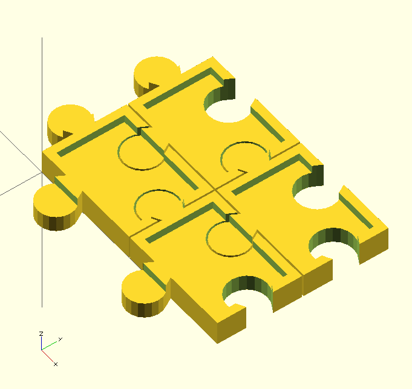
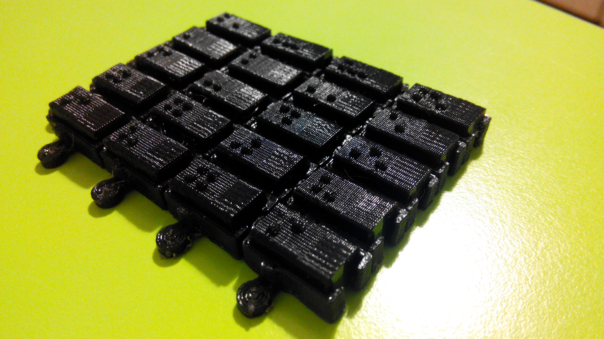

# Braille cross letter puzzle

## Description 

The idea is to make one of these suitable for Braille users.

## Plan

The plan is to build an underlying puzzle-like structure of frames used to hold Braille letters.

Puzzle:

- base element prototype:

  

- letter block:

  

Updated puzzle inter-lock:

3D printing results:

## Results

It looks like this:

