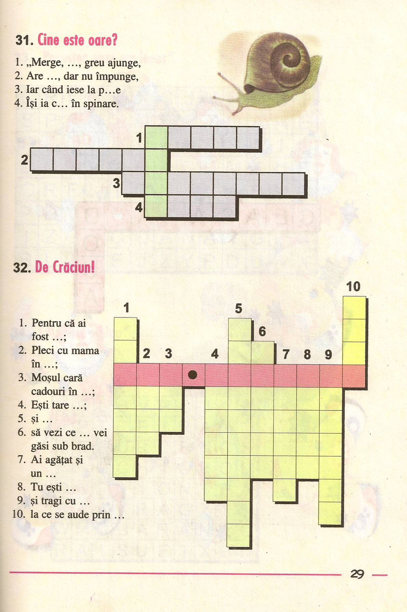
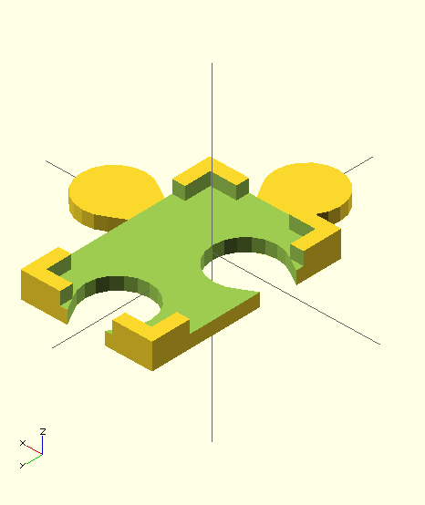
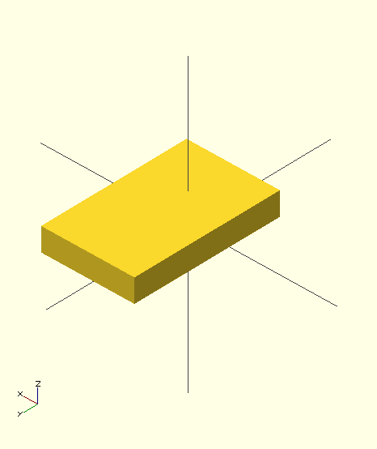

# Braille cross letter puzzle

## Description 

The idea is to make one of these suitable for Braille users.

## Plan

The plan is to build an underlying puzzle-like structure of frames used to hold Braille letters.

Puzzle:

- base element prototype:

  

- letter block:

  

## TODO

- investigate how to generate letters

Use [OpenSCAD grade2 braille font module](http://www.thingiverse.com/thing:74358). It looks like this:   .

See [3rd-party/uploads-61-31-b9-e3-34-braille.scad](3rd-party/uploads-61-31-b9-e3-34-braille.scad)

- parametric letter block

- parametric puzzle-base

