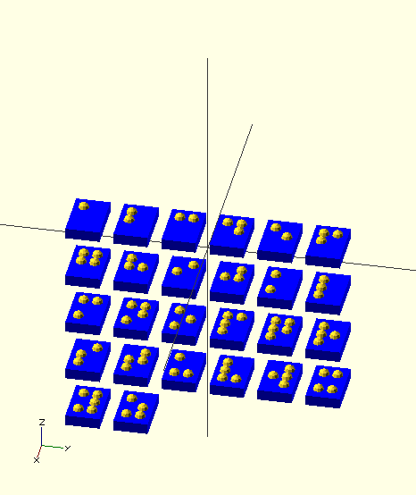
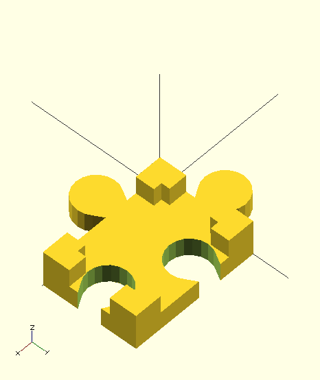
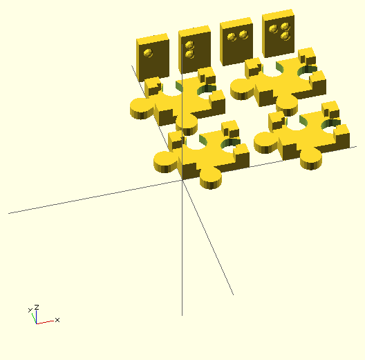

# Braille cross letter puzzle

## Description 

The idea is to make one of these suitable for Braille users.

## Plan

The plan is to build an underlying puzzle-like structure of frames used to hold Braille letters.

Puzzle:

- base element prototype:

  

- letter block:

  

## TODO

### investigate how to generate letters (in progress)

Use [OpenSCAD grade2 braille font module](http://www.thingiverse.com/thing:74358). It looks like this:   .

See [3rd-party/uploads-61-31-b9-e3-34-braille.scad](3rd-party/uploads-61-31-b9-e3-34-braille.scad)

Modified braille.scad file to generate rows of letters. See [braille-letter.scad](braille-letter.scad)

### parametric letter block

### parametric puzzle-base (in progress)

Switched puzzle\_base from using absolute value to parameters.

  

Imported Braille letter fits perfectly.

  

Created a test for puzzle-base and braille-letter:

  

Aborted print due to a filament problem. Partial results:

  

Puzzle connectors need to be adjusted as they don't fit easily.

