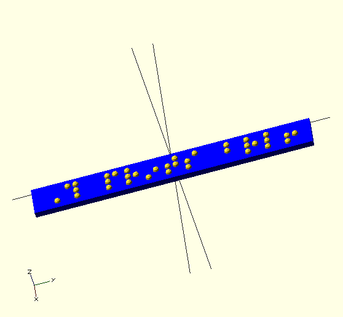
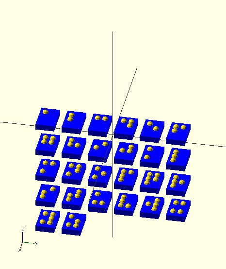
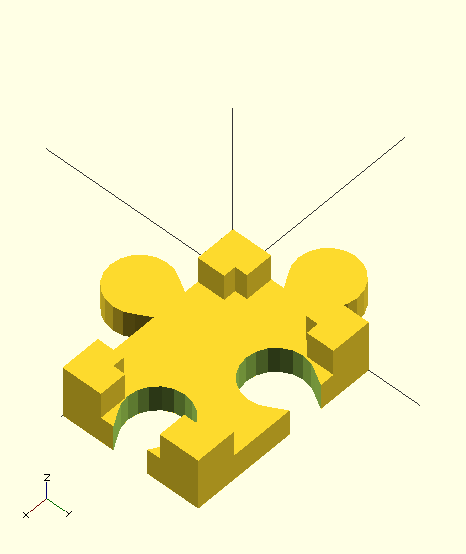
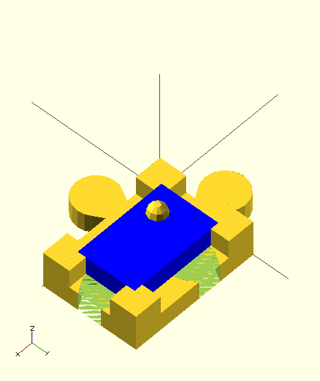
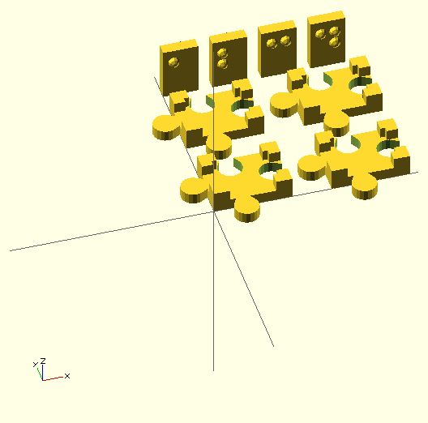
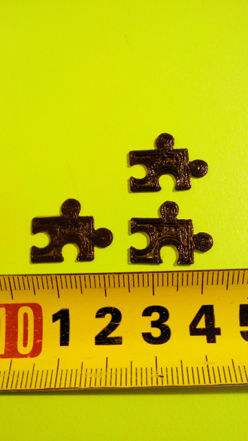
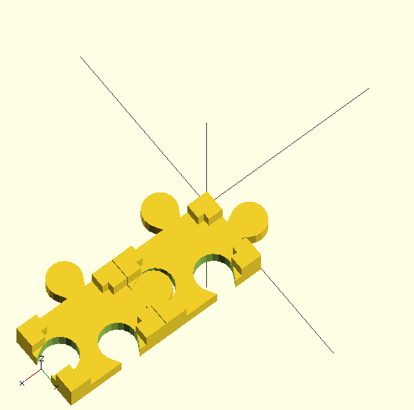

## Tasks

### DONE investigate how to generate letters (in progress) 

Use [OpenSCAD grade2 braille font module](http://www.thingiverse.com/thing:74358). It looks like this:   .

See [3rd-party/uploads-61-31-b9-e3-34-braille.scad](3rd-party/uploads-61-31-b9-e3-34-braille.scad)

Modified braille.scad file to generate rows of letters. See [braille-letter.scad](braille-letter.scad)

### DONE parametric letter block

### DONE parametric puzzle-base (in progress)

Switched puzzle\_base from using absolute value to parameters.

  

Imported Braille letter fits perfectly.

  

Created a test for puzzle-base and braille-letter:

  

Aborted print due to a filament problem. Partial results:

  

Puzzle connectors need to be adjusted as they don't fit easily:

  

### TODO change letter size

### TODO use better connectors

Based on [Creating cookie cutters using offsets (and minkowski sums) in OpenSCAD to make your honey happy](http://blog.cubehero.com/2013/12/31/creating-cookie-cutters-using-offsets-in-openscad/)
